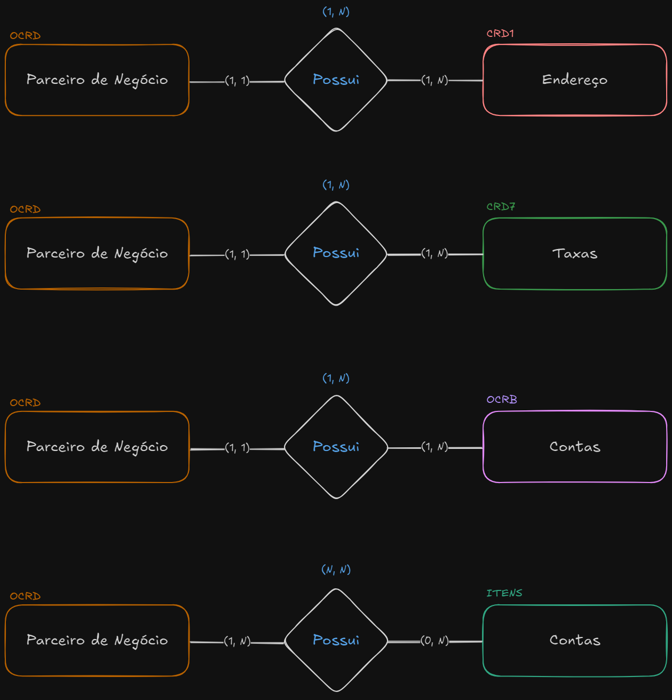

# Estrutura do Banco de Dados

Esta ponderada foi desenvolvida com o propósito de modelagem dos dados mestres do projeto de implementação SAP B1 dentro da G2 Consultoria. Para o desenvolvimento dessa ponderada foi realizada a estruturação do banco de dados dentro do SQL Design, um Modelo Entidade Relacionamento e um README para facilitar a avaliação da correção.

### Instruções:

1. Abra o site [SQL Designer](https://sql.toad.cz/)
2. Entre em *Save / Load* no canto direito superior
3. Cole o código a baixo dentro do *Input / Output*
<details>
  <summary>Código XML!</summary>

```xml
<?xml version="1.0" encoding="utf-8" ?>
<!-- SQL XML created by WWW SQL Designer, https://github.com/ondras/wwwsqldesigner/ -->
<!-- Active URL: https://sql.toad.cz/ -->
<sql>
<datatypes db="mysql">
	<group label="Numeric" color="rgb(238,238,170)">
		<type label="Integer" length="0" sql="INTEGER" quote=""/>
	 	<type label="TINYINT" length="0" sql="TINYINT" quote=""/>
	 	<type label="SMALLINT" length="0" sql="SMALLINT" quote=""/>
	 	<type label="MEDIUMINT" length="0" sql="MEDIUMINT" quote=""/>
	 	<type label="INT" length="0" sql="INT" quote=""/>
		<type label="BIGINT" length="0" sql="BIGINT" quote=""/>
		<type label="Decimal" length="1" sql="DECIMAL" re="DEC" quote=""/>
		<type label="Single precision" length="0" sql="FLOAT" quote=""/>
		<type label="Double precision" length="0" sql="DOUBLE" re="DOUBLE" quote=""/>
	</group>

	<group label="Character" color="rgb(255,200,200)">
		<type label="Char" length="1" sql="CHAR" quote="'"/>
		<type label="Varchar" length="1" sql="VARCHAR" quote="'"/>
		<type label="Text" length="0" sql="MEDIUMTEXT" re="TEXT" quote="'"/>
		<type label="Binary" length="1" sql="BINARY" quote="'"/>
		<type label="Varbinary" length="1" sql="VARBINARY" quote="'"/>
		<type label="BLOB" length="0" sql="BLOB" re="BLOB" quote="'"/>
	</group>

	<group label="Date &amp; Time" color="rgb(200,255,200)">
		<type label="Date" length="0" sql="DATE" quote="'"/>
		<type label="Time" length="0" sql="TIME" quote="'"/>
		<type label="Datetime" length="0" sql="DATETIME" quote="'"/>
		<type label="Year" length="0" sql="YEAR" quote=""/>
		<type label="Timestamp" length="0" sql="TIMESTAMP" quote="'"/>
	</group>
	
	<group label="Miscellaneous" color="rgb(200,200,255)">
		<type label="ENUM" length="1" sql="ENUM" quote=""/>
		<type label="SET" length="1" sql="SET" quote=""/>
		<type label="Bit" length="0" sql="bit" quote=""/>
	</group>
</datatypes><table x="100" y="100" name="OCRD">
<row name="CardCode" null="1" autoincrement="1">
<datatype>VARCHAR(15)</datatype>
<default>NULL</default></row>
<row name="CardName" null="0" autoincrement="0">
<datatype>VARCHAR(100)</datatype>
<default>'NULL'</default></row>
<row name="CardForeignName" null="1" autoincrement="0">
<datatype>VARCHAR(100)</datatype>
<default>NULL</default></row>
<row name="CardType" null="1" autoincrement="0">
<datatype>ENUM</datatype>
<default>NULL</default></row>
<row name="GroupCode" null="1" autoincrement="0">
<datatype>VARCHAR(100)</datatype>
<default>NULL</default></row>
<row name="Phone1" null="1" autoincrement="0">
<datatype>VARCHAR</datatype>
<default>NULL</default></row>
<row name="Phone2" null="1" autoincrement="0">
<datatype>VARCHAR</datatype>
<default>NULL</default></row>
<row name="Cellular" null="1" autoincrement="0">
<datatype>VARCHAR</datatype>
<default>NULL</default></row>
<row name="Fax" null="1" autoincrement="0">
<datatype>VARCHAR</datatype>
<default>NULL</default></row>
<row name="Notes" null="1" autoincrement="0">
<datatype>VARCHAR(255)</datatype>
<default>NULL</default></row>
<key type="PRIMARY" name="">
<part>CardCode</part>
</key>
</table>
<table x="402" y="600" name="CRD1">
<row name="ParentKey" null="1" autoincrement="1">
<datatype>VARCHAR(15)</datatype>
<default>NULL</default><relation table="OCRD" row="CardCode" />
</row>
<row name="AddressType" null="1" autoincrement="0">
<datatype>ENUM</datatype>
<default>NULL</default></row>
<row name="AddressName" null="0" autoincrement="0">
<datatype>VARCHAR(50)</datatype>
<default>'NULL'</default></row>
<row name="TypeOfAddress" null="1" autoincrement="0">
<datatype>VARCHAR(100)</datatype>
<default>NULL</default></row>
<row name="Street" null="1" autoincrement="0">
<datatype>VARCHAR(100)</datatype>
<default>NULL</default></row>
<row name="StreetNo" null="1" autoincrement="0">
<datatype>VARCHAR(100)</datatype>
<default>NULL</default></row>
<row name="Block" null="0" autoincrement="0">
<datatype>VARCHAR(100)</datatype>
<default>'NULL'</default></row>
<row name="City" null="1" autoincrement="0">
<datatype>VARCHAR(100)</datatype>
<default>NULL</default></row>
<row name="County" null="1" autoincrement="0">
<datatype>VARCHAR(100)</datatype>
<default>NULL</default></row>
<row name="State" null="1" autoincrement="0">
<datatype>VARCHAR(3)</datatype>
<default>NULL</default></row>
<row name="ZipCode" null="1" autoincrement="0">
<datatype>VARCHAR(20)</datatype>
<default>NULL</default></row>
<row name="Country" null="1" autoincrement="0">
<datatype>INTEGER(3)</datatype>
<default>NULL</default></row>
<row name="BuildingFloorRoom" null="1" autoincrement="0">
<datatype>MEDIUMTEXT(64000)</datatype>
<default>NULL</default></row>
<key type="PRIMARY" name="">
<part>ParentKey</part>
</key>
</table>
<table x="402" y="282" name="CRD7">
<row name="ParentKey" null="1" autoincrement="1">
<datatype>VARCHAR(15)</datatype>
<default>NULL</default><relation table="OCRD" row="CardCode" />
</row>
<row name="Address" null="1" autoincrement="0">
<datatype>VARCHAR(50)</datatype>
<default>NULL</default></row>
<row name="TaxId0" null="1" autoincrement="0">
<datatype>VARCHAR(100)</datatype>
<default>NULL</default></row>
<row name="TaxId1" null="1" autoincrement="0">
<datatype>VARCHAR(100)</datatype>
<default>NULL</default></row>
<row name="TaxId2" null="1" autoincrement="0">
<datatype>VARCHAR(100)</datatype>
<default>NULL</default></row>
<row name="TaxId3" null="1" autoincrement="0">
<datatype>VARCHAR(100)</datatype>
<default>NULL</default></row>
<row name="TaxId4" null="1" autoincrement="0">
<datatype>VARCHAR(100)</datatype>
<default>NULL</default></row>
<row name="TaxId5" null="1" autoincrement="0">
<datatype>VARCHAR(100)</datatype>
<default>NULL</default></row>
<row name="TaxId6" null="1" autoincrement="0">
<datatype>VARCHAR(100)</datatype>
<default>NULL</default></row>
<row name="TaxId7" null="1" autoincrement="0">
<datatype>VARCHAR(100)</datatype>
<default>NULL</default></row>
<row name="TaxId8" null="1" autoincrement="0">
<datatype>VARCHAR(100)</datatype>
<default>NULL</default></row>
<key type="PRIMARY" name="">
<part>ParentKey</part>
</key>
</table>
<table x="402" y="22" name="OCRB">
<row name="ParentKey" null="1" autoincrement="1">
<datatype>VARCHAR(15)</datatype>
<default>NULL</default><relation table="OCRD" row="CardCode" />
</row>
<row name="County" null="1" autoincrement="0">
<datatype>VARCHAR(100)</datatype>
<default>NULL</default></row>
<row name="BankCode" null="1" autoincrement="0">
<datatype>VARCHAR(30)</datatype>
<default>NULL</default></row>
<row name="Branch" null="1" autoincrement="0">
<datatype>VARCHAR(50)</datatype>
<default>NULL</default></row>
<row name="UserNo1" null="1" autoincrement="0">
<datatype>VARCHAR(25)</datatype>
<default>NULL</default></row>
<row name="AccountNo" null="1" autoincrement="0">
<datatype>VARCHAR(50)</datatype>
<default>NULL</default></row>
<row name="UserNo2" null="1" autoincrement="0">
<datatype>VARCHAR(25)</datatype>
<default>NULL</default></row>
<row name="AccountName" null="1" autoincrement="0">
<datatype>VARCHAR(100)</datatype>
<default>NULL</default></row>
<key type="PRIMARY" name="">
<part>ParentKey</part>
</key>
</table>
<table x="102" y="504" name="ITENS">
<row name="ItemCode" null="1" autoincrement="1">
<datatype>VARCHAR(20)</datatype>
<default>NULL</default></row>
<row name="ItemName" null="1" autoincrement="0">
<datatype>INTEGER(100)</datatype>
<default>NULL</default></row>
<row name="ForeignName" null="1" autoincrement="0">
<datatype>VARCHAR(100)</datatype>
<default>NULL</default></row>
<row name="ItemsGroupCode" null="1" autoincrement="0">
<datatype>VARCHAR</datatype>
<default>NULL</default></row>
<row name="ItemType" null="1" autoincrement="0">
<datatype>ENUM</datatype>
<default>NULL</default></row>
<row name="PurchaseItem" null="1" autoincrement="0">
<datatype>ENUM</datatype>
<default>NULL</default></row>
<row name="SalesItem" null="1" autoincrement="0">
<datatype>ENUM</datatype>
<default>NULL</default></row>
<row name="InventoryItem" null="1" autoincrement="0">
<datatype>ENUM</datatype>
<default>NULL</default></row>
<row name="Manufacturer" null="1" autoincrement="0">
<datatype>VARCHAR</datatype>
<default>NULL</default></row>
<row name="ShipType" null="1" autoincrement="0">
<datatype>VARCHAR</datatype>
<default>NULL</default></row>
<row name="ManageSerialNumbers" null="1" autoincrement="0">
<datatype>ENUM</datatype>
<default>NULL</default></row>
<row name="ManageBatchNumbers" null="1" autoincrement="0">
<datatype>ENUM</datatype>
<default>NULL</default></row>
<row name="IsPhantom" null="1" autoincrement="0">
<datatype>ENUM</datatype>
<default>NULL</default></row>
<row name="ItemClass" null="1" autoincrement="0">
<datatype>ENUM</datatype>
<default>NULL</default></row>
<row name="MaterialType" null="1" autoincrement="0">
<datatype>ENUM</datatype>
<default>NULL</default></row>
<row name="NCMCode" null="1" autoincrement="0">
<datatype>VARCHAR</datatype>
<default>NULL</default></row>
<row name="ProductSource" null="1" autoincrement="0">
<datatype>ENUM</datatype>
<default>NULL</default></row>
<row name="PurchaseUnit" null="1" autoincrement="0">
<datatype>VARCHAR(20)</datatype>
<default>NULL</default></row>
<row name="PurchaseItemsPerUnit" null="1" autoincrement="0">
<datatype>INTEGER(40)</datatype>
<default>NULL</default></row>
<row name="SalesUnit" null="1" autoincrement="0">
<datatype>VARCHAR(20)</datatype>
<default>NULL</default></row>
<row name="SalesItemsPerUnit" null="1" autoincrement="0">
<datatype>INTEGER(40)</datatype>
<default>NULL</default></row>
<row name="InventoryUOM" null="1" autoincrement="0">
<datatype>VARCHAR(20)</datatype>
<default>NULL</default></row>
<row name="MinInventory" null="1" autoincrement="0">
<datatype>INTEGER(40)</datatype>
<default>NULL</default></row>
<row name="MaxInventory" null="1" autoincrement="0">
<datatype>INTEGER(40)</datatype>
<default>NULL</default></row>
<row name="PlanningSystem" null="1" autoincrement="0">
<datatype>ENUM</datatype>
<default>NULL</default></row>
<row name="ProcurementMethod" null="1" autoincrement="0">
<datatype>ENUM</datatype>
<default>NULL</default></row>
<key type="PRIMARY" name="">
<part>ItemCode</part>
</key>
</table>
<table x="402" y="997" name="OCRD_ITENS">
<row name="id" null="1" autoincrement="1">
<datatype>INTEGER</datatype>
<default>NULL</default></row>
<row name="CardCode" null="1" autoincrement="0">
<datatype>VARCHAR(15)</datatype>
<default>NULL</default><relation table="OCRD" row="CardCode" />
</row>
<row name="ItemCode" null="1" autoincrement="0">
<datatype>VARCHAR(20)</datatype>
<default>NULL</default><relation table="ITENS" row="ItemCode" />
</row>
<key type="PRIMARY" name="">
<part>id</part>
</key>
</table>
</sql>
```
4. Clique no botão *LOAD XML* após colar o código.

## Relacionamentos

O modelo Entidade Relacionamento está representado a baixo. Dentro desse modelo foi relacionada a tabela OCRD com as demais tabelas de dados mestres. As associações estão descritas a baixo da imagem


- A tabela `CRD1` possui uma chave estrangeira `ParentKey` que referencia `OCRD.CardCode`.
- A tabela `CRD7` possui uma chave estrangeira `ParentKey` que referencia `OCRD.CardCode`.
- A tabela `OCRB` possui uma chave estrangeira `ParentKey` que referencia `OCRD.CardCode`.
- A tabela `OCRD_ITENS` relaciona `OCRD` e `ITENS` através dos campos `CardCode` e `ItemCode`.

## Tabelas

### OCRD (Tabela de Clientes)

Armazena os dados dos clientes da aplicação, como código, nome e informações de contato.

- **CardCode** (VARCHAR 15, PK): Código único do cliente.
- **CardName** (VARCHAR 100, NOT NULL): Nome do cliente.
- **CardForeignName** (VARCHAR 100, NULL): Nome estrangeiro do cliente.
- **CardType** (ENUM, NULL): Tipo do cliente.
- **GroupCode** (VARCHAR 100, NULL): Código do grupo ao qual o cliente pertence.
- **Phone1** (VARCHAR, NULL): Telefone principal do cliente.
- **Phone2** (VARCHAR, NULL): Telefone secundário do cliente.
- **Cellular** (VARCHAR, NULL): Número de celular do cliente.
- **Fax** (VARCHAR, NULL): Número de fax do cliente.
- **Notes** (VARCHAR 255, NULL): Observações adicionais sobre o cliente.

### CRD1 (Endereços dos Clientes)

Armazena os endereços dos clientes associados à tabela `OCRD`.

- **ParentKey** (VARCHAR 15, FK): Código do cliente, relacionado a `OCRD.CardCode`.
- **AddressType** (ENUM, NULL): Tipo de endereço (residencial, comercial, etc.).
- **AddressName** (VARCHAR 50, NOT NULL): Nome do endereço.
- **TypeOfAddress** (VARCHAR 100, NULL): Tipo de endereço (logradouro, número, etc.).
- **Street** (VARCHAR 100, NULL): Nome da rua.
- **StreetNo** (VARCHAR 100, NULL): Número do endereço.
- **Block** (VARCHAR 100, NOT NULL): Bairro ou quarteirão.
- **City** (VARCHAR 100, NULL): Cidade.
- **County** (VARCHAR 100, NULL): Condado.
- **State** (VARCHAR 3, NULL): Estado.
- **ZipCode** (VARCHAR 20, NULL): Código postal.
- **Country** (INTEGER 3, NULL): Código do país.
- **BuildingFloorRoom** (MEDIUMTEXT, NULL): Detalhes sobre andar ou sala.

### CRD7 (Informações Fiscais do Cliente)

Armazena informações fiscais e tributárias relacionadas ao cliente.

- **ParentKey** (VARCHAR 15, FK): Código do cliente, relacionado a `OCRD.CardCode`.
- **TaxId0** - **TaxId8** (VARCHAR 100, NULL): Identificadores fiscais adicionais.

### OCRB (Contas Bancárias dos Clientes)

Armazena informações bancárias dos clientes.

- **ParentKey** (VARCHAR 15, FK): Código do cliente, relacionado a `OCRD.CardCode`.
- **County** (VARCHAR 100, NULL): Condado.
- **BankCode** (VARCHAR 30, NULL): Código do banco.
- **Branch** (VARCHAR 50, NULL): Agência bancária.
- **AccountNo** (VARCHAR 50, NULL): Número da conta bancária.
- **AccountName** (VARCHAR 100, NULL): Nome do titular da conta.

### ITENS (Tabela de Itens)

Armazena os produtos ou itens disponíveis para compra e venda.

- **ItemCode** (VARCHAR 20, PK): Código único do item.
- **ItemName** (INTEGER 100, NULL): Nome do item.
- **ForeignName** (VARCHAR 100, NULL): Nome estrangeiro do item.
- **ItemsGroupCode** (VARCHAR, NULL): Código do grupo de itens.
- **ItemType** (ENUM, NULL): Tipo do item.
- **PurchaseItem** (ENUM, NULL): Se o item está disponível para compra.
- **SalesItem** (ENUM, NULL): Se o item está disponível para venda.
- **InventoryItem** (ENUM, NULL): Se o item é um item de inventário.
- **Manufacturer** (VARCHAR, NULL): Fabricante do item.
- **ShipType** (VARCHAR, NULL): Tipo de transporte.
- **ManageSerialNumbers** (ENUM, NULL): Indica se o item tem números de série gerenciados.
- **ManageBatchNumbers** (ENUM, NULL): Indica se o item tem números de lote gerenciados.
- **IsPhantom** (ENUM, NULL): Indica se o item é um item fantasma.
- **ItemClass** (ENUM, NULL): Classe do item.
- **MaterialType** (ENUM, NULL): Tipo de material do item.
- **NCMCode** (VARCHAR, NULL): Código NCM do item.
- **ProductSource** (ENUM, NULL): Origem do produto.
- **PurchaseUnit** (VARCHAR 20, NULL): Unidade de compra do item.
- **PurchaseItemsPerUnit** (INTEGER 40, NULL): Quantidade de itens por unidade de compra.
- **SalesUnit** (VARCHAR 20, NULL): Unidade de venda do item.
- **SalesItemsPerUnit** (INTEGER 40, NULL): Quantidade de itens por unidade de venda.
- **InventoryUOM** (VARCHAR 20, NULL): Unidade de medida de inventário.
- **MinInventory** (INTEGER 40, NULL): Inventário mínimo.
- **MaxInventory** (INTEGER 40, NULL): Inventário máximo.
- **PlanningSystem** (ENUM, NULL): Sistema de planejamento.
- **ProcurementMethod** (ENUM, NULL): Método de aquisição.

### OCRD_ITENS (Relacionamento entre Clientes e Itens)

Armazena as informações de relacionamento entre clientes e os itens comprados ou vendidos.

- **id** (INTEGER, PK): Identificador único da relação.
- **CardCode** (VARCHAR 15, FK): Código do cliente, relacionado a `OCRD.CardCode`.
- **ItemCode** (VARCHAR 20, FK): Código do item, relacionado a `ITENS.ItemCode`.


